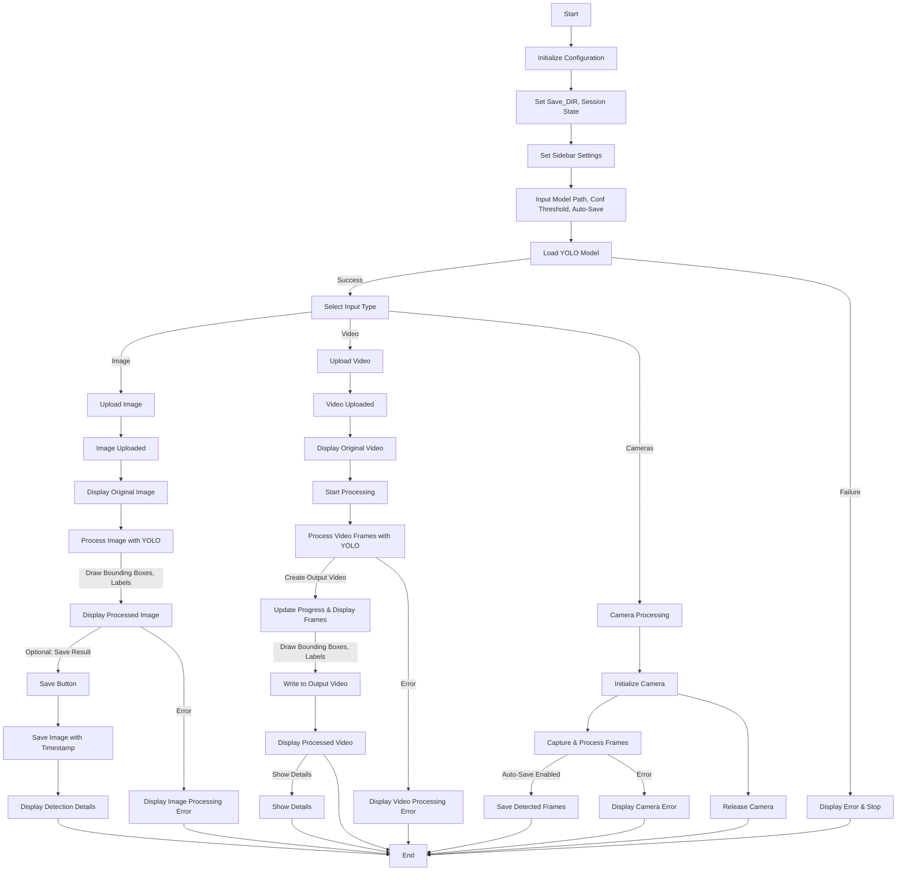

本项目基于ultralytics，此版本是加入了SE attention以及faster net的修改

```mermaid
flowchart TD
    A[Start] --> B[Initialize Configuration]
    B --> C[Set Save_DIR, Session State]
    C --> D[Set Sidebar Settings]
    D --> E[Input Model Path, Conf Threshold, Auto-Save]
    E --> F[Load YOLO Model]
    F -->|Success| G[Select Input Type]
    G -->|Image| H[Upload Image]
    G -->|Video| I[Upload Video]
    G -->|Cameras| J[Camera Processing]
    
    H --> K[Image Uploaded]
    K --> L[Display Original Image]
    L --> M[Process Image with YOLO]
    M -->|Draw Bounding Boxes, Labels| N[Display Processed Image]
    N -->|Optional: Save Result| O[Save Button]
    O --> P[Save Image with Timestamp]
    P --> Q[Display Detection Details]
    N -->|Error| R[Display Image Processing Error]
    
    I --> S[Video Uploaded]
    S --> T[Display Original Video]
    T --> U[Start Processing]
    U --> V[Process Video Frames with YOLO]
    V -->|Create Output Video| W[Update Progress & Display Frames]
    W -->|Draw Bounding Boxes, Labels| X[Write to Output Video]
    X --> Y[Display Processed Video]
    Y -->|Show Details| Z[Show Details]
    V -->|Error| AA[Display Video Processing Error]
    
    J --> AB[Initialize Camera]
    AB --> AC[Capture & Process Frames]
    AC -->|Auto-Save Enabled| AD[Save Detected Frames]
    AC -->|Error| AE[Display Camera Error]
    AB --> AF[Release Camera]
    
    Q --> AG[End]
    Y --> AG
    AD --> AG
    AF --> AG
    R --> AG
    AA --> AG
    AE --> AG
    Z --> AG
    F -->|Failure| AH[Display Error & Stop]
    AH --> AG
```